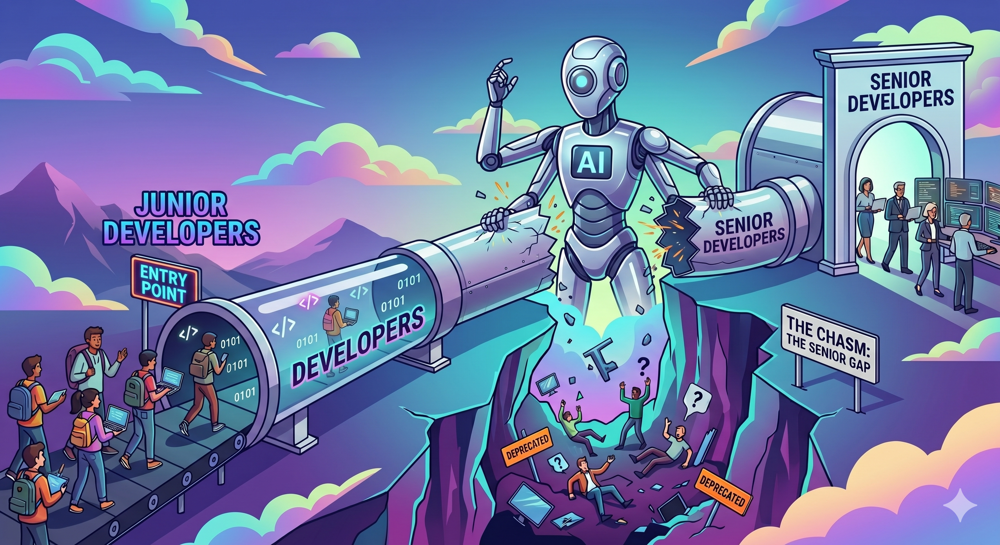

I'm worried about junior developers.

Not in the abstract, industry-think-piece way. I mean the actual people – the ones who just finished a CS degree, or taught themselves, or came through a bootcamp, or switched careers because they loved building things. The ones who are just starting.

I'm worried for two reasons.

### What's happening inside the craft

When you can ask AI to write the function, the temptation to skip understanding *why* it works that way is enormous. And that "why" is exactly what you need later – when the system breaks in production at 2am, when AI gives you three confident suggestions that all make it worse, when you need to know whether to trust the output you're looking at.

### What's happening outside it

The industry is quietly removing the entry point. Junior roles are collapsing – measurably, in the data, right now. The most common explanation is that AI can do what juniors used to do. That's not entirely wrong. But I think it's missing something important about what junior developers were actually *for*.

These two things together are what worries me. Not because the field is dying – it isn't. But because we're setting a generation of developers up to fail in a specific, preventable way, and then pointing at the failure as proof they were never needed.

*We broke the Junior-to-Senior pipeline, for all the wrong reasons*

## The Numbers Aren't Subtle

Between 2023 and 2024, employment for software developers aged 22 to 25 [dropped nearly 20%](https://digitaleconomy.stanford.edu/app/uploads/2025/11/CanariesintheCoalMine_Nov25.pdf). That's from [Stanford's Digital Economy Lab](https://digitaleconomy.stanford.edu/publication/canaries-in-the-coal-mine-six-facts-about-the-recent-employment-effects-of-artificial-intelligence/), using actual ADP payroll records. The 15 largest tech firms [cut entry-level hiring 25% year over year](https://www.signalfire.com/blog/signalfire-state-of-talent-report-2025).

*Hm.*

In physics, when two things happen simultaneously you have three possible explanations: causation, correlation, or you're measuring the wrong variable. The "AI replaced junior developers" story assumes the first.

I want to make the case for the third – because the variable everyone's measuring is wrong, and that mistake is costing junior developers their careers while the industry dismantles the thing that produces senior engineers.

The question worth asking isn't "how do we adapt to a world with fewer junior developers." It's "what exactly do we think we're cutting, and what happens when it's gone?"

That's what this is about.

## The Wrong Diagnosis

When companies started cutting junior roles, they weren't being arbitrary. The math made sense. Junior developers did lower-complexity work. AI does lower-complexity work cheaper and faster. Eliminate the role.

The problem isn't the logic – it's the premise. It assumes junior developers were *for* the output they produced. They aren't.

### The prep cook problem

Imagine a restaurant decides to fire all its prep cooks because they just got a top-of-the-line food processor that can, technically, do everything a prep cook does. The math works – you've eliminated a salary.

What the math doesn't capture: the food processor doesn't run itself. Someone still has to decide what goes in, notice when the output is wrong, and course-correct when it isn't. That someone is now the head chef.

And the head chef is no longer doing the things only they could do – thinking about tomorrow's menu, training the junior line cooks, catching the supplier mistake before it becomes a dinner service disaster. The prep cook work got done. Everything else quietly stopped happening.

That's what's happening in engineering teams right now.

We've seen this before, just slower. During the 2008 financial crisis, tech companies froze junior hiring – same logic, tighter budgets. For a few years, it was fine. Then, somewhere around 2012, those same companies started struggling to find engineers with a few years of experience under their belt. Not because the talent disappeared – because it was never hired to start. The pipeline didn't slow down. It stopped. And nobody noticed until they needed what it was supposed to be producing.

The pattern is predictable even if nobody tracked it carefully: freeze junior hiring for two years, and a few years later you have a gap in your mid-level pipeline. It's arithmetic, not speculation.

We're running the same experiment again. With better justification and significantly less awareness that we've run it before.

## The Real Value of a Junior Developer

If the output was never really the point, what was?

This is where I think the industry's mental model breaks down. When companies look at a junior developer, they see a person producing a certain volume of a certain kind of work. When that work can be done by AI, the person looks redundant. But that framing misses everything that was happening around the output – the things that don't show up in a ticket tracker but absolutely show up when they're gone.

### The pipeline is a supply chain

Senior engineers don't appear from nowhere. They are junior engineers who survived enough broken deployments and bad architectural decisions to build real judgment. Cut the pipeline in 2026 and you don't feel it this year. You feel it in 2030, when your senior engineers are burning out and the people who should have been ready to replace them were never hired to start.

### New minds are what keep computer science moving

Computer science moves the way it does — faster than any other scientific discipline — largely because it gets constantly infused with new minds. Physics, by contrast, is dominated by established researchers; paradigm shifts take generations. That's not a criticism — it's the nature of a field where experiments take years and theories take decades to validate. The pace is appropriate to the work. 

But computer science has a fundamentally different nature: the field reinvents itself every few years, and a significant part of why is that every graduating class brings different assumptions, different cultural references, different instincts about what problems are worth solving and how.

Junior developers don't just become senior engineers eventually. They change what senior engineers think about while they're still junior. Cut that pipeline and you don't just lose future talent — you lose the mechanism that keeps the field from calcifying.

### Juniors ask "why" when seniors stopped

At some point, experienced engineers stop asking why things work the way they do. Not because we know everything – because we assume we do. We've seen enough systems, made enough decisions, formed enough opinions that the answer feels obvious. And we're right a lot of the time. That's what experience is.

But sometimes the answer we absorbed was wrong. Or it was right for a system that no longer exists. Or it made sense in 2016 and the codebase has changed around it and now it's just load-bearing folklore that nobody has examined in years. Experience gives you pattern recognition, but it also gives you blind spots – and the blind spots are invisible by definition.

Junior developers ask "why does this work this way?" constantly. It can feel like noise. It is often, quietly, a linter for bad architecture. The question that sounds naive is sometimes the one that exposes the assumption nobody has examined in four years. Teams without juniors lose that signal – not dramatically, just gradually, one unasked question at a time.

### The complexity didn't disappear – it moved

You eliminated the junior developer. You did not eliminate the junior *work*. It moved onto your senior engineers, who absorb it without flagging it because each task feels too small to escalate. Small tasks at senior salaries, plus context-switching costs, plus the architectural thinking that didn't happen because someone was writing boilerplate – that's not a saving. It's a transfer.

## AI Amplifies What You Bring To It

The [2025 DORA report](https://cloud.google.com/blog/products/ai-machine-learning/announcing-the-2025-dora-report) surveyed nearly 5,000 tech professionals and found something worth sitting with: AI doesn't fix a team – it amplifies what's already there. Strong teams got more efficient. Struggling teams got more efficiently stuck. The tool didn't change the underlying dynamic. It accelerated it.

That's the thing nobody's saying clearly enough about AI and junior developers. AI isn't neutral. It amplifies whatever you bring to it – including the gaps.

### If you don't have a mental model, AI fills the gap with noise

Every measurement instrument has a resolution limit – a threshold below which it can't distinguish signal from noise. Below that threshold, it doesn't refuse to give you a reading. It gives you a confident-looking number that happens to be wrong.

AI coding tools work exactly the same way. If you have a solid mental model of the system you're building – how the pieces fit together, what the constraints are, what failure looks like – AI is genuinely powerful. It accelerates work you already understand.

But if you don't have that mental model yet, AI doesn't say "I'm not sure." It generates. Plausibly structured, syntactically valid, confidently presented – and potentially wrong in ways that won't surface until the system is under load, or until someone tries to extend it six months from now. The output looks right. It might even pass tests. You won't know it's wrong until production tells you.

### "Just use AI" is different advice depending on who you are

Experienced engineers don't trust AI blindly. What they can do is let it run further before they check the work, because they know what to look for when they do. They've felt the specific wrongness of a solution that works in a demo and falls apart in production. That accumulated experience is what makes validation meaningful – you know what "right" looks like for your specific system, so you can spot when something is off.

A junior developer isn't in that position yet. Without that mental model, what looks like validation is just a second look at output you can't fully evaluate. You catch the obviously wrong answers. You miss the subtly wrong ones. And AI produces the subtle kind far more often than the obvious kind.

This is why "just use AI tools" lands so differently depending on who's hearing it. For a senior engineer, it's a productivity multiplier with a well-calibrated error-correction loop. For a junior who hasn't built that loop yet, it's a productivity multiplier with no error-correction at all. The tool is the same. What you bring to it isn't.

### AI won't tell you when the answer is wrong for your context

One more thing AI won't do: tell you when a technically correct solution is wrong for your specific situation.

In physics, there's no universal "correct" position – only position relative to a reference frame. Software architecture works the same way. Microservices aren't good or bad. They're good *relative to* a certain scale, team size, and deployment context. A monolith is the right answer *relative to* different constraints.

AI will build you a microservices architecture for a two-person startup, confidently, with a README. It will do it well. It won't ask whether that's right for your situation – because it doesn't know your situation unless you tell it. And knowing what to tell it, knowing which constraints matter and why, is itself a systems thinking skill. One that takes time and experience to build.

## Systems Thinking Isn't Just for Seniors Anymore

Systems thinking was always treated as something you grew into – not something you started with. It lived in staff engineer job descriptions, in architecture reviews, in conversations you got invited to after enough years. The unspoken assumption: first you learn to write code, then eventually you learn to think about systems.

That framing had a consequence: systems thinking was never urgent for junior developers. And because it wasn't urgent, it wasn't explicit.

### The algorithms were always teaching more than algorithms

There's an old joke in CS education. You spend a semester on binary trees and sorting algorithms. You get the job. You never think about them again.

The joke is right about the content. It's wrong about what was happening while you learned it.

The algorithms curriculum wasn't really about algorithms. It was about exposure – to multiple problem shapes, multiple reasoning patterns, multiple ways a solution can be correct in one context and catastrophically wrong in another. Struggling through a problem you couldn't immediately solve was building the debugging reflex, the pattern recognition, the ability to sit with confusion long enough to reason through it.

The tree traversal wasn't the point. Struggling through the tree traversal was the point.

AI removes the struggle. Which means junior developers can now arrive at working output without the process that builds judgment about output. Nobody designed this trap. It's just what happens when you hand someone a very good answer machine before they've developed the instincts to evaluate answers.

### The market already knows

Since 2023, [programmer employment in the US fell 27.5%](https://fortune.com/2025/03/17/computer-programming-jobs-lowest-1980-ai/) – the steepest drop of any occupation tracked by the Bureau of Labor Statistics. Software *developer* employment – designing and reasoning about systems – is down just 0.3%. Same industry. Very different trajectories. The labor market already made the distinction between syntax execution and systems thinking. It just didn't tell anyone.

## What To Actually Do

Systems thinking is learnable. It always was. The urgency to teach it explicitly just didn't exist until now.

One prerequisite: you still need foundational knowledge to know what you're reasoning *about*. The advice isn't "skip the fundamentals and focus on architecture." It's use AI deliberately, and build the concepts alongside it – not instead of it.

### When AI gives you something you don't understand, that's the assignment

Treat AI-generated code you don't understand as a learning target, not a finished product. Before moving on, write two or three sentences about what the code assumes. What does it expect to be true? What breaks if the database is slow, or if this runs twice simultaneously? If you can't write those sentences, you don't understand it well enough to own it. And you will eventually need to own it.

Track what you consistently outsource to AI. That category is a learning target.

### Try it yourself before you ask AI

When learning something new, attempt it manually first. Write the query, then see what AI would have written. The gap between your version and AI's version is information – about edge cases you missed, patterns you haven't seen. Skipping straight to AI's version teaches you nothing except that AI can do it.

### Study failure modes, not just happy paths

A material's strength is defined by how it fails under stress, not how it behaves normally.

Software systems are the same. For any feature you build, write down the failure modes before you write the implementation. What are the three most likely ways this breaks? Where does it fail loudly versus silently? This is what good code review actually looks like.

### Practice explaining why, not just what

If you can describe what a system does but not why it was designed that way, you don't fully understand it yet. Pick one piece of the codebase and write a paragraph about why it was built this way – what constraints shaped it, what alternatives were rejected. If you can't, you've found your next learning target.

This also makes you better at using AI. "Here's what I'm building, here's why it's designed this way, here's my constraint" produces dramatically better output than "write me a function that does X."

### Use AI to stress-test your model, not replace it

Once you have a mental model – even a partial, uncertain one – use AI as an adversary. "Here's how I think this system works. What am I missing? What breaks under load? What would a senior engineer push back on?"

That's using AI to accelerate the process that builds judgment, rather than skip it. AI amplifies whatever mental model you bring. Bring a developing one and interrogate it, and AI becomes a lever. Bring nothing, and it fills the gap with confident-sounding noise.

## You're Not in the Wrong Field. You're in the Wrong Frame.

The role that's collapsing is the junior developer as syntax executor – the person whose value was producing boilerplate faster than a senior would bother to. That role was always going to be vulnerable to automation, because automation is exactly what it was doing.

The role that's surviving is the developer who can reason about systems. Who can look at AI-generated code and know whether it's right for this context. Who can ask "why does this work this way" and understand the answer well enough to know when it's wrong.

But it's more than that. The developer role is increasingly becoming a role that *directs* AI systems – deciding what to build, how to structure it, what tradeoffs to make, and whether the output actually solves the right problem. That requires operating at a higher level than the code itself. It requires knowing enough about architecture, patterns, and failure modes to assess what's needed before the first line gets written, and to evaluate what came back after.

That's the job. And the uncomfortable truth for junior developers right now is that the industry has stopped giving out the experience that builds those skills, but the skills are still required. The old path – get hired, get mentored, break things in low-stakes environments, slowly accumulate judgment – has been disrupted. Which means juniors have to be more deliberate about acquiring that experience than any previous generation has had to be. It won't just happen to you anymore. You have to go get it.

That's harder. It's also doable.

And the developers who figure out how to do it – who treat every AI-generated function as a thing to understand, every system they touch as a thing to reason about, every architectural decision as a thing to interrogate – are the ones who will have the skills the market is now paying for, even if the market hasn't finished figuring out how to hire for them yet.

## The Tech Industry is in a Phase Transition

In physics, phase transitions happen when a system crosses a threshold and its properties change discontinuously. The tech job market is in phase transition right now. The developers who understand what state they're transitioning *into* are the ones who will be well-positioned when equilibrium arrives.

You are not in the wrong field. You are in the wrong frame. And frames are changeable.

Every senior engineer you admire was once a junior who didn't know what they were doing. They had time and mentorship to figure it out. You have less of both – so you'll have to be more intentional about it.

But here's the thing: that intentionality is exactly what the job now requires anyway. You're not being asked to do less than previous generations. You're being asked, earlier than anyone used to be, to think like an engineer rather than just code like one.

That's a harder starting condition… but it's a much better destination.
