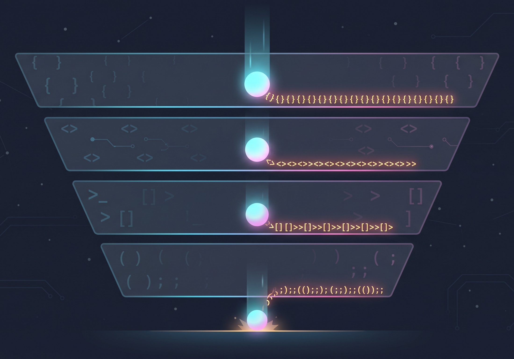

A while back I watched someone proudly announce they'd "gotten rid of all the complexity" in a piece of code. Everything was decoupled now. Configurable. Clean separation of concerns. Honestly, by the metrics they cared about, beautiful work.

Then a teammate asked how to render a button.

What followed was a five-step explanation involving a factory, a config object, a theme token, a registry, and a choice between two base classes to extend. The complexity hadn't gone anywhere. It had just changed addresses – from "inside the component" to "inside your head, every time you want a button."

This isn't a story about bad code. It's a story about an assumption almost everyone makes without noticing: that complexity is something you can get rid of. You can't. You can only move it. And it turns out there's a really satisfying reason why – one that comes straight out of physics, and that I think is worth understanding properly rather than just borrowing as a metaphor. So let's do both: some real physics, and what it has to say about your codebase.

## Okay, but first: actual physics

Here's a law that holds everywhere, always, with zero known exceptions: energy is conserved. It doesn't disappear. It converts.

Drop a ball from a height. At the top, it has potential energy – energy stored in its position, just waiting. As it falls, that converts into kinetic energy – energy of motion. And when it hits the ground? That energy doesn't vanish either. Some becomes heat. Some becomes sound – that's literally what the "thud" is. Some goes into deforming whatever it landed on. If you know the height, you can account for every joule. Nothing's missing. It just keeps changing costumes.

Roller coasters are basically a 90-second tour of this law. The first big drop has to be tall enough to carry the car through every loop and turn after it, because there's no engine after the first hill. It's all conversion, no creation, the whole ride.

Here's a more interesting case, though: regenerative braking. A normal car converts the kinetic energy of braking into heat through friction – energy that's still fully accounted for, it's just converted into something nobody's using, dispersed into the air as your brake pads complain. It's wasted, not destroyed. A hybrid or electric car does something smarter with that same energy: instead of letting it scatter as useless heat, it converts that kinetic energy back into electricity and tucks it into the battery for later, actually putting it to use. Same physical law, same starting energy, completely different outcome – one system wastes it, one system redirects it on purpose.

*Regenerative breaking utilizes conservation of energy to store the energy in the battery*

And no matter how good the engineering gets, you'll never recapture all of it. Some always leaks out as friction, as heat, as the universe taking its cut. You can't get that to zero. What you *can* do is decide how much gets wasted versus how much gets put to good use. That decision is where the actual engineering happens – not the conservation law itself, which just sits there quietly being true.

## Wait – but *why* is it true?

This is the part where, if you don't have a physics background, you've probably just been nodding along and trusting me. Which is fair! But I think the actual answer here is too good to skip, and you don't need any math to get it.

Here's a question worth sitting with for a second: why *can't* energy just stop existing? Why is the universe so weirdly strict about this one specific thing?

The answer starts somewhere that doesn't sound like physics at all: the laws that govern how stuff moves and interacts don't care *when* you run the experiment. Drop a ball today, drop it tomorrow, drop the same ball next century – same result, every single time. There's no "Tuesday version" of gravity. No special exception for 3pm. The rules are exactly, perfectly the same regardless of when you check.

That sameness has a name – physicists call it a *symmetry* – and it sounds almost too simple to matter. But here's the truly beautiful part: in 1915, a mathematician named Emmy Noether proved that this specific kind of sameness *forces* a conservation law to exist. Not as a coincidence. Not as an empirical "huh, we checked and it's always true." As a mathematical certainty – if the laws of physics don't change over time, then *something* has to be conserved, and that something turns out to be energy. The conservation law isn't a separate fact about the universe. It's the same fact as "physics doesn't have a Tuesday version," just looked at from a different angle.

(And in case you think this is just elegant philosophy with no teeth: it's testable, and it's been tested. Our universe is expanding, and that expansion is accelerating – which means that "sameness over time" actually breaks down very slightly at cosmic scales. And when it does, energy conservation gets a little bit leaky right along with it: light from the early universe actually loses energy as space stretches, drifting from visible light toward microwaves over billions of years. The symmetry breaks, and the conservation law breaks exactly in step with it. That's not a coincidence. That's the whole point.)

So: energy is conserved not because the universe arbitrarily decided to be tidy about it, but because *when* you do something doesn't change what happens. Find the thing that doesn't change, and you've found what's conserved.

## So what's the symmetry in software?

I love this question, because it means the comparison I'm about to make isn't just a cute metaphor – it's the same move Noether made, aimed at a completely different system.

If a conservation law comes from finding the thing that *doesn't* change, what's the unchanging thing in software that makes complexity conserved?

Here's my answer: **the problem doesn't get easier just because your code did.**

*Complexity exists somewhere in the software. You better decide which layer, or the decision will be made for you*

A date-formatting library can hide every timezone quirk, every calendar exception, every locale weirdness behind one clean function call. That doesn't mean timezones got simpler. It means a human, somewhere, sat down and absorbed all of that mess so you wouldn't have to look at it. The domain's actual demands – what reality requires, regardless of how you choose to implement it – don't budge just because your API got nicer. That invariance is the symmetry. Conservation of complexity is what falls out of it.

*If you want the longer version of this idea – including the skit that kicked off this whole post, the physics walkthrough with the ball and the regenerative brakes, and a tour through Android vs. Apple as two platforms that made opposite bets on exactly this question – [the video's right here](https://www.youtube.com/watch?v=jA82t0UIvhM). Same core idea, different examples – think of this post as the director's commentary, not the recap.*

## The example you can go check on your phone right now

Here's one that's close to my own background, and that you can verify in about ten seconds without leaving this page.

Say you're building an app that needs to support right-to-left languages – Arabic, Hebrew, and others. The "simple" version of this advice is: set `direction: rtl` on the container. Text flows right to left, layout mirrors, and visually, things look correct. Done, right?

Mostly! But go find a phone number field, or an email field, in an RTL layout. Chances are it's *not* mirrored – the digits and the `@` sign read left to right, even though everything around them is flowing the other way. That's not a bug. That's a widget library quietly making a decision on your behalf: phone numbers, emails, URLs, and code aren't "language" in the sense that flips with direction – they're data, with their own internal structure that doesn't care what language surrounds it.

If you tried to handle this yourself from scratch, you'd discover fast that the list of exceptions is enormous, and they're not edge cases – they're the normal case. Numbers inside RTL sentences. Mixed-direction text where an English product name sits inside an Arabic paragraph. Icons that carry directional meaning (a "back" arrow) versus icons that don't (a play button). Each one is a tiny decision about whether *this specific thing* should follow the surrounding direction or quietly ignore it.

A good widget library has already made all of these decisions for you. That's why it feels simple. Not because the problem is simple – because someone absorbed the complexity *into the library*, at a level below where you're working, so you'd never have to think about it.

And here's the part that matters: that complexity hasn't gone anywhere. It's just moved down a layer. Which is great, right up until you need to build something the library didn't anticipate. The moment you create a custom widget, or extend the library somewhere it wasn't designed to go, you're suddenly the one deciding "should this mirror or not?" You've stepped down into the layer where that complexity actually lives. Sometimes there's *another* layer below that one – shared utilities, a directionality-detection function, something the library's own authors built so they wouldn't have to re-solve this in every component – and you get to lean on that instead. But the complexity doesn't stop existing just because you can't see it from where you're standing.

Whatever you do, it's *somewhere*, and it costs something. Usually that cost is configurability: the more a library absorbs on your behalf, the less control you have over the cases it didn't anticipate. That's not a flaw – it's the trade. You're paying in flexibility for not having to think about phone numbers and bidirectional text every time you build a form. Whether that's a good trade depends entirely on what you're building, and whether you actually know the trade is happening.

## So what do you do with all this?

You're not going to eliminate complexity. That was never on the table – not in physics, not in your codebase. What you *can* do is make sure it ends up somewhere on purpose, instead of somewhere by accident.

A few questions that help:

**Where did it go?** Every time something gets "simplified" – an API gets a sensible default, a library absorbs a decision, an abstraction layer goes in – something else just started carrying weight it wasn't carrying before. Go find that something.

**Is whoever's holding it equipped for it?** A library author who deliberately absorbs timezone handling, or directionality logic, or retry behavior, can usually do a much better job of it than every consumer reinventing it badly, one app at a time. But if the "holder" turns out to be just "future you, six months from now, with no documentation" – that's not absorption, that's procrastination wearing a nice outfit.

**Is this consistent with the rest of the system?** If formatting complexity lives in your utilities layer everywhere *except* this one component, that's not a simplification – it's just a place where the next person (quite possibly you) is going to go looking in the wrong spot.

None of this is about writing more complex code, or less complex code. It's about being able to answer, for any given piece of complexity in your system: *I know where this lives, I know why it lives there, and that was a choice.*

That's the whole law, really. You can't get rid of complexity any more than you can get rid of energy. But you can be the one who decides where it lives – instead of finding out the hard way, in production, at 2am, exactly where it ended up.

---

*This post is a companion to [The Physics of Software: Conservation of Complexity](https://www.youtube.com/watch?v=jA82t0UIvhM) – a video with the same core idea, a different set of examples, a skit about a button that requires seven configuration steps, and considerably more jokes. If this kind of thing is your kind of thing, [subscribe on YouTube](https://www.youtube.com/@MorielTech) – there's more physics where this came from.*