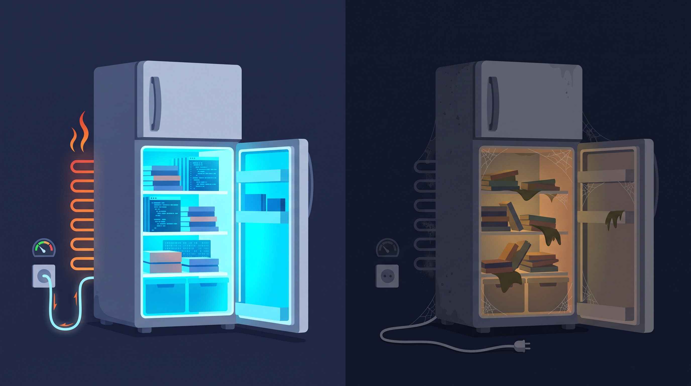

The way we talk about tech debt is getting in the way of fixing it.

"Debt" says someone borrowed something. A corner was cut, and now the bill is due. So when an old system starts falling apart, we go looking for the place where the corner was cut.

That can be true sometimes, but it isn't the full picture. Tech debt can happen when the code is perfect. It can happen when the code is solid and impressively organized. Most code doesn't rot because of how it was written. It rots because of what happens around it after it's written.

The library you picked gets abandoned. The browser changes an API. A security fix lands in a version you're three majors behind on. The person who knew why that module looks the way it does leaves the team. Nobody touched your code, and it still got worse, because the world it was built for moved on without it.

So here's the rule: code that nobody invests in decays. Not "might." Does. And the longer it goes without investment, the more it costs to bring back. A small, steady amount of maintenance costs far less than the big rescue you'll need if you skip it.

Physics has a name for this pattern. It's called entropy, and the clearest example of it is humming in your kitchen right now.

## Tech debt is the wrong word for most of it

The term Tech Debt comes from Ward Cunningham, who introduced the [debt metaphor in 1992](https://www.agilealliance.org/wp-content/uploads/2016/05/IntroductiontotheTechnicalDebtConcept-V-02.pdf) to explain refactoring to his boss: you ship code that reflects your current, partial understanding of the problem, and you pay it back by updating the code as you learn more.

It's a good metaphor for what it describes: a trade you choose to make, and a cost you choose to pay back later. But somewhere along the way, "tech debt" stretched to cover every bit of code that needs work. And a lot of that work doesn't come from any trade at all. Plenty of systems degrade without anyone taking on anything.

Codebases don't rot because of bad decisions. They rot because of decisions, period. Every decision encodes an assumption about the world at the moment it was made. Then the world moves, and the assumption doesn't.

That's why "where was the corner cut?" is usually the wrong question. The useful question is: who is paying to keep this working, and how much? To see why that payment never stops, look at your fridge.

## Your fridge is heating up your kitchen

Your fridge keeps the inside cold. To do that, it has to put the heat somewhere, and that somewhere is your kitchen.

Not a little, and not by accident. A running fridge puts more heat into your kitchen than it takes out of your food, every minute it's on. Get close to the coils at the back and you can feel it. Just don't touch. It's hot.

Why does it have to work so hard? Because heat only moves one way on its own: from warmer to cooler. Your kitchen is warmer than the inside of the fridge, so heat is always leaking in, through the walls and every time you open the door. Left alone, it keeps leaking until the inside is the same temperature as the room.

*Left: maintenance. Right: a migration project waiting to happen.*

That leak is entropy at work. But to see why it matters, you need to know what entropy measures, because it's not what most people think.

## Entropy isn't "disorder." It's energy that can't do anything anymore.

Energy does work when it moves from one place to another, and it only moves when there's a difference. Hot here, cold there. High here, low there. Charged on one side, empty on the other. Water flowing downhill can turn a wheel. Heat flowing from hot to cold can push a piston. The difference is the part you can use.

Unplug your fridge and wait a day. The inside warms up to room temperature. No energy was lost. All of it is still in your kitchen. But now the inside and the outside are the same temperature, so nothing flows. There's nothing left to push on. The energy is all still there, balanced, and it can't do anything.

That's what physicists mean by **entropy**: a measure of how evenly energy has spread out, and so how little of it can still do work. You'll often hear entropy described as "disorder" or "randomness." That's not exactly wrong, but it misses the point. The problem isn't that things get messy. The problem is that once everything has evened out, there's nothing left to move the system. Low entropy means differences you can use to do work. High entropy means everything has leveled out, and nothing is left to drive anything.

The **Second Law of Thermodynamics** says that in an isolated system, one that's sealed off with nothing coming in or going out, entropy only goes up. Differences even out, and they never come back on their own. Batteries drain. The unplugged fridge warms up. Never the other way around.

Now put code in place of the fridge. For software, "useful" means "able to do its job in the world as it is right now." When code ships, it fits: its assumptions match the libraries, the browsers, the APIs, the team that knows it. That fit is the difference you can work with. Leave the code alone, and the world drifts while the code stays put, until the fit is gone. Every line is still there. It just can't do the job anymore.

## Keeping order is a running cost

So how does a fridge stay cold for years? It isn't an isolated system. It's plugged into the wall.

A fridge uses electricity to pump heat out of the inside and push it out the coils at the back. The pumping itself takes work, which also ends up as heat. So the coils release *all* the heat taken from your food, *plus* the energy the motor used to move it. Order inside the box, paid for by outside input.

An external investment was made so the internal system does not decay.

If you've read the [Conservation of Complexity]([#](https://blog.moriel.tech/posts/conservation-of-complexity/)) post, you might be wondering how this squares with energy being conserved. It still does. The fridge doesn't create cold out of nothing. You just have to zoom out: the system isn't "the inside of the fridge" anymore, because the inside of the fridge is getting an injection of outside energy. The new system where energies are conserved is now bigger: It's the fridge, the kitchen, the power line, and the power plant at the other end of it. Add all of that up and conservation holds, and total entropy still goes up. You didn't beat the second law. You zoomed out of the original box, because it is no longer your "isolated" system.

And the payment never stops. Unplug the fridge for a long weekend and you don't just lose the cold. You lose the food, you spend an afternoon cleaning, and maybe you're replacing shelves. Getting back to a working fridge costs far more than the electricity it would have taken to keep it running.

**Software works the same way.** A dependency upgrade every month is a small, boring task. A dependency upgrade after three years of skipping them is a migration project: breaking changes stacked on breaking changes, docs for versions that no longer exist, and nobody left who remembers why things were done that way. It's the same work, except now it has compounded.

Physics gives you exactly two ways to fight decay: put energy in to clean things up, or swap a degraded part for a fresh one from outside. In software, cleaning is refactoring and upgrading in place. Replacing is rewriting a component or swapping a dependency. Both are outside input. Neither is free. And neither is ever done.

https://www.youtube.com/watch?v=vAMqzFqNT0E

*If you'd rather watch than read: here's the same idea, told with rust, cobwebs, and an engineer who should not have opened that laptop.*

## Nobody touched it. That was the problem.

Here's my favorite real-world example, and it comes from the place I've spent a big chunk of my career: Wikipedia.

Every Wikipedia article is held up by its citations. Links out to news articles, papers, government pages, the sources that make the claims verifiable. An article can sit there, untouched, perfectly written, carefully sourced.

And it rots anyway.

Not because anyone edited it badly. Because the web around it moved. News sites redesign and break their URLs. Organizations shut down. Domains expire. Pages get deleted. Every citation was correct the day it was added. Then the world moved, and the link didn't. The article didn't change at all, and it still got worse.

That's entropy. A system treated as isolated, sitting in an environment that keeps changing around it.

So what keeps Wikipedia's citations working? An outside energy source.

The Internet Archive archives new links as they get added to Wikipedia. Then a bot called **InternetArchiveBot**, built and run by volunteer developer Maximilian Doerr, crawls articles looking for links that have died. When it finds one, it looks for an archived copy and swaps it in. By 2018, that effort had [repaired around 9 million broken links](https://techcrunch.com/2018/10/02/internet-org-project-helps-restore-millions-of-broken-wikipedia-links), about 6 million by the bot and 3 million by hand, by volunteers. As of this year, the broader project had [fixed more than 30 million](https://blog.archive.org/2026/04/23/gone-but-not-forgotten-recovering-the-dead-web/) across hundreds of wikis.

Look at what that bot is, through the physics lens. It's the fridge motor. It's continuous, deliberate work pumped into the system from outside, so the system can keep doing its job. Take it away and Wikipedia's sourcing doesn't hold steady. It decays, a few thousand links at a time, and nobody has to do anything wrong for that to happen.

And notice the other half of the fridge, too: the cost didn't vanish. It moved. Somewhere there are servers storing hundreds of billions of archived pages, a bot running around the clock, and volunteers checking its work. Wikipedia's local order is paid for by a lot of heat out the back.

Also notice that the job never ends. The bot doesn't "fix link rot." It fixes this week's link rot. Next week, more of the web will be gone. That's not a sign the approach is failing. That's what fighting entropy looks like. It's a running cost, not a project with a finish line.

## Software engineering figured this out in the 70s

None of this is a new observation about software. It's just rarely framed as physics.

In 1974, Meir "Manny" Lehman, studying IBM's OS/360, started writing down what became the [laws of software evolution](https://www.cs.kent.edu/~jmaletic/cs63902/Papers/Lehman96.pdf). One of them says that as a program evolves, its complexity goes up unless someone does work to maintain or reduce it. Another says a program used in the real world has to keep adapting, or it gets steadily less useful.

Read those again with the fridge in mind. *Unless work is done.* That's the second law, discovered from version histories.

*The Pragmatic Programmer* even has a section called "Software Entropy," about how one broken window invites more neglect. That's the social side of it, and it's real. But the physics points at something more uncomfortable: you don't need a broken window for a building to decay. You just need time, an environment that moves, and nobody putting energy in.

## Teams rust too

The same shape shows up in people.

A senior engineer who knows why every module looks the way it does leaves the team. The code didn't change. But the team's ability to work with it did. All the context about *why* walked out the door, and the system got harder to change without a single line being touched.

And a team that only looks inward, that never brings in an outside perspective or questions decisions that made sense three years ago, is treating itself as an isolated system. Its thinking drifts out of step with the world the same way the code does.

Same law. Different material.

## Budget for it like the physics is real

If we treat tech debt as a failure, the response is blame. If we treat it as entropy, the response is a budget.

Here's what that changes in practice:

**Assume decay is the default.** A system nobody is touching is not stable. It's getting worse at the rate the world around it changes. "It's been fine for two years" is not evidence that it's fine. It might just mean nobody has looked.

**Make maintenance a line item, not leftovers.** "We'll clean it up when we have time" doesn't work, because time is the thing causing the problem. Waiting for time to fix entropy is how entropy wins. Decide up front how much capacity goes to keeping things running, and protect it like you protect feature work. Small and steady is cheaper than late and large, every time.

**Know whether you're cleaning or replacing.** Those are the two physics moves, and they're different decisions. Cleaning is refactoring, upgrading, fixing in place. Replacing is rewriting a component or swapping a dependency. Both cost energy, but they have very different risk and very different price tags. Name which one you're doing before you start.

**Automate the input where you can.** InternetArchiveBot works because it never gets tired or distracted by a launch. Dependency update bots, scheduled upgrade sprints, automated link and API checks: anything that keeps the energy flowing without depending on someone remembering is worth a lot.

**Account for where the heat goes.** Cleaning one part of a system exports cost somewhere else: migration work for the teams that depend on you, review time, a learning curve for everyone else. That's the coils at the back of the fridge. Plan for it instead of being surprised by it.

**Open the team on purpose.** Write down the *why*, not just the *what*, so context doesn't leave with people. Bring in outside perspective. Revisit old decisions regularly and ask if they still fit the world as it is now.

## The hum of the fridge

Next time you're in your kitchen, listen for the fridge kicking on. That hum is the sound of order being paid for. It runs because the moment it stops, everything inside starts warming up to match the room.

Your codebase needs the same hum. Not a heroic cleanup every two years, but a steady motor, running in the background, pushing back against the world moving on. It's not failure when a system decays. It's the default. The only real question is whether anyone is keeping it plugged in.

If you want the same idea with rust, cobwebs, and a little more theater, the video is up there. And if there's a physics law you keep seeing show up in your work, [tell me](https://moriel.tech/contact). I'm always looking for the next one.