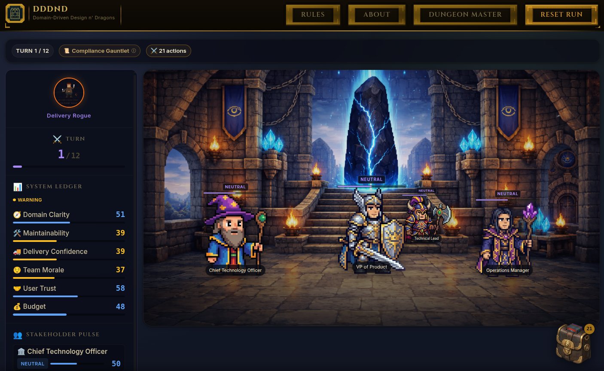
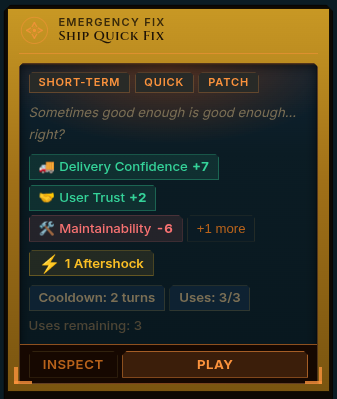
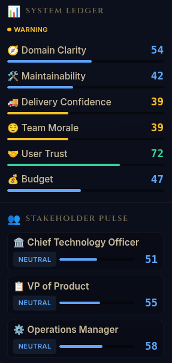
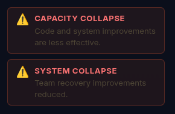
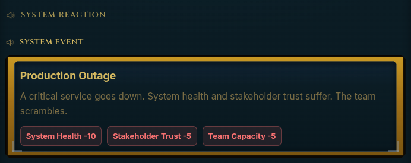
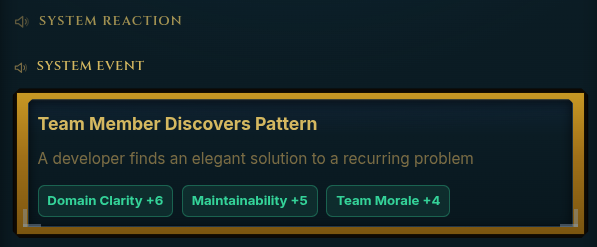
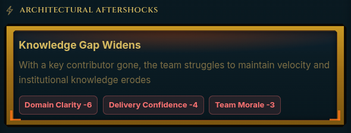
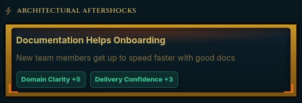

I've been thinking about software development as an adventure for a long time.

Not in the motivational-poster sense — *every bug is a quest!* — but genuinely: the way a software project unfolds has all the bones of a good game. You have to make decisions under incomplete information. You have to balance competing stakeholders with legitimate but incompatible goals. You have to accrue consequences that arrive three sprints later, wearing a different name. There are no correct answers, only tradeoffs you'll have to live with.

For years, I have had this idea sitting in the back of my head: what if you could *play* that? Not as a tutorial. Not as a productivity tool dressed up with points. As an actual game, where the decisions are real and the humor comes from recognition.

Then AI-assisted development happened, and suddenly a side project I'd been slowly building could actually become something. I spent a couple of months of my spare time bringing the concept to life — redesigning the architecture, iterating on the game mechanics, building fairness testing tools to make sure the simulation wasn't quietly broken, and writing the content that makes the cards feel true rather than just clever. It was one of those projects that kept revealing new layers the deeper I got into it.

There's a lot more I want to write about: the grander purpose behind the game, the technical decisions under the hood, and what the process of building it with AI assistance actually looked like in practice. That's all coming.

But for now — here it is.

I'd like to introduce you to **DDDnD**: a satirical game about the very real constraints of software development.

*DDDnD main game screen, showing system state, four stakeholders, and your satchel with 21 available actions*

## You Ship the Quick Fix. We All Know You Ship the Quick Fix.

There's a card in DDDnD called **Ship Quick Fix**.

It reads: *+7 delivery confidence, +2 user trust, -6 maintainability. Delayed effect: <code>technical_debt_accumulates</code>.*

How many meetings have you been in where someone said exactly that? Not as a villain monologue — as a reasonable call, made by a reasonable person, under real constraints? Now imagine it's a turn in a card game. You pick it up. You read it. And you think: *yeah, I'm playing this.*

That's DDDnD. And it knows you.

## What You're Actually Playing

DDDnD is a card-based strategy game where you're a system architect trying to keep a software system alive. Each turn, you draw from a deck of architectural decisions — real ones, not quiz answers — and you play them against a set of running scores: delivery confidence, maintainability, domain clarity, team morale, budget. Stakeholders watch those numbers and respond accordingly.

*DDDnD game sidebar, featuring the 'system ledger' and the stakeholder states.*

The VP of Product wants features. The CTO cares whether your domain model is holding together. The Lead Developer is paying attention to whether you're actually paying down debt or just saying you will. None of them are wrong. All of them are problems.

And then the system itself has opinions. Let scores drop too far in the wrong direction and the game applies a system response — a constraint that makes recovery actively harder until you address the root cause. Not a punishment. A consequence. The kind that shows up in real codebases as "we can't ship anything new until we fix the thing we ignored in Q2."

*System coupling notices, letting you know the system is in a collapse state, challenging your actions.*

The scenarios have names like **The Monolith of Mild Despair** and **Microservice Sprawl**. If you've been in this industry for more than five years, you likely felt something reading those. And that's the point.

At the end of a run, you don't get a score that says you won or lost. You get a verdict: what kind of architect did you become? **The Firefighter.** **The Boundary Builder.** The game tracks *who you turned into*, not just whether the numbers stayed green.

## The Decisions Are the Game

Here's what makes this not just a bit:

The decisions are genuinely contested. Consider **Accept Technical Debt Amnesty** — a one-time card that reads: *"We'll deal with it next quarter. Definitely next quarter."* Morale goes up 8. Maintainability drops 7. Delayed effect: debt accumulates anyway.

That is not a joke card. That is a description of a real decision, made in real organizations, that real architects defend in real retrospectives, every day. The humor isn't that the choice is dumb. It's that you'll take it. You might take it *twice*. And depending on your scenario, it might even be the right call.

On the other side: **Define Bounded Context** is the responsible play. It improves domain clarity and maintainability. The CTO approves. Your delayed effect is called `boundaries_clarify`, which is the kind of thing you might put in a slide deck with pride.

It also costs delivery confidence and budget this sprint. So your VP of Product is now typing in Slack.

Neither card is "wrong". The simulation doesn't have a correct answer. It has consequences — and the consequences depend on your seed, your scenario, and what you played in the last three turns.

## Why This Lands

The humor in DDDnD works because it's recognition humor, not ridicule. The stakeholders aren't cartoons. The decisions aren't gotchas. The CTO going quiet when your domain clarity drops isn't a punchline — it's just a very astute simulation of what happens when you balance the tradeoffs of real life constraints.

The quick fix is appealing because quick fixes *are* appealing. Debt amnesty is seductive because kicking the can does, in fact, feel better in the short term. The game doesn't punish you for being human about it. It just makes sure the delayed effects actually arrive.

And then sometimes, independent of everything you've done, the world has thoughts.

*Random event: Production outage. Unexpected bad things happen in real life, too.*

A random event fires: **Critical Bug Discovered**. Delivery confidence drops. Team morale drops. User trust drops. You didn't cause this one — or maybe you did, three turns ago, and it just surfaced now. Either way, it's yours. On a better day, the event is **Team Member Discovers Pattern**: domain clarity up, maintainability up, morale up. Someone figured something out. That happens too.

*Random event: Team member discovers pattern. Unexpected good things happen, too, and can save your sprint.*

This is the detail that makes the simulation feel honest rather than just clever: you can make every right call, have a fully aligned team and a clean architecture, and life still happens. The game doesn't pretend otherwise.

That's the design choice that elevates this past satire: **the simulation is deterministic, but the world isn't.** Same seed, same scenario, same decisions → same conditions. It's not throwing chaos at you randomly. It's modeling the specific chaos that shows up in real systems — including the parts that weren't your fault.

## What a Run Actually Feels Like

You open on **Microservice Sprawl**: fourteen services, eight teams, two people who understand the event bus. Your initial scores are already shaky. You have three cards in hand and a board review in two turns.

You play the quick fix. Delivery confidence jumps. You feel good.

Turn three: `technical_debt_accumulates`. You knew. You knew when you played it.

*Another type of an architectural aftershock, revealing itself a couple of turns after applying a card.*

You pull **Introduce Anti-Corruption Layer**. It's expensive. It's slow. It's the right call for two turns from now. You play it, your budget drops, and the VP of Product opens a ticket asking why the sprint velocity is down.

Then a system response kicks in: maintainability has been low too long. Your options narrow. Some cards are locked until you address it. You're not being punished — you're experiencing the part where the codebase starts making decisions for you.

And then: **Critical Bug Discovered**. Of course.

By turn six, you're either the Boundary Builder or you're the Firefighter putting out a fire you started on turn two. Either way, you understand why.

*A positive architectural aftershock can also happen, noting a delayed benefit from an earlier investment.*

## This Is Not Just A Satire

DDDnD is funny because it's true. But it's also *useful* because it's true.

Playing it is a surprisingly effective way to feel — not just understand — why "we'll fix it later" has the consequences it does. Why domain clarity isn't a nice-to-have. Why your CTO and your VP of Product can both be right and still make your choices extremely difficult. And why sometimes a team member discovers something brilliant on turn four and saves the whole run, and you still don't know exactly why that sprint felt different.

It's a lens. A game that makes the tradeoffs tangible without making you responsible for a production system while you figure it out.

Play it at [dddnd.app](https://dddnd.app). Or forward this to someone who's been in a room where "we'll deal with it next quarter" was said out loud — and believed.

They'll know immediately what this is about.

## Acknowledgments

The seed for this game was planted in a conversation with [Kate Chapman](https://untanglingsystems.io) and [Diana Montalion](https://montalion.com/) at [DDD Europe](https://dddeurope.com/) 2024, which is either poetic or on-brand, depending on how you feel about bounded contexts. Thanks to them, and to the DDD community at large, for the inspiration. And to the playtesters who sat with early versions of this and gave honest feedback: you are the Lead Developers of this story, and I mean that as the highest compliment.

---

*No systems were harmed in the making of this game. Any resemblance to your actual codebase is entirely intentional.*
