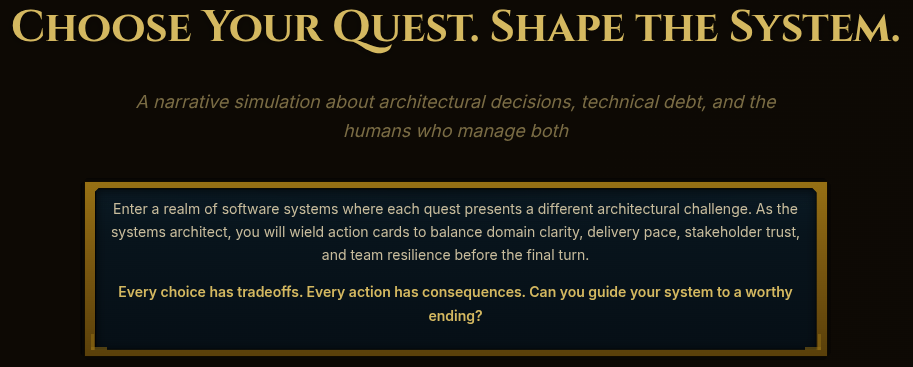
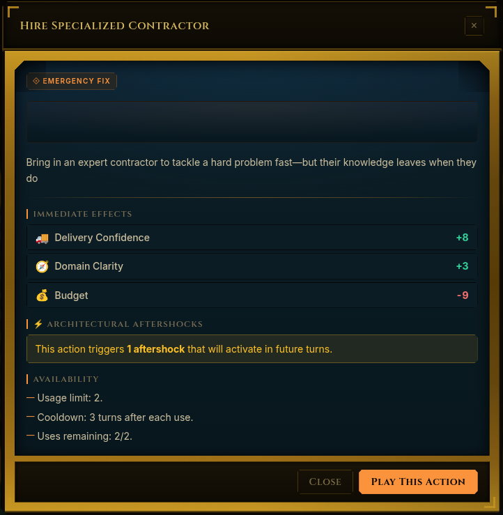
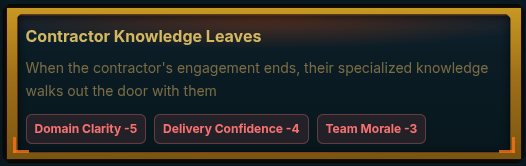
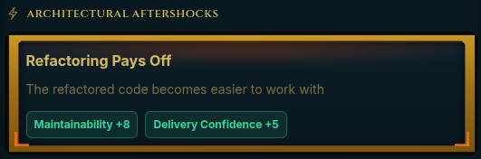
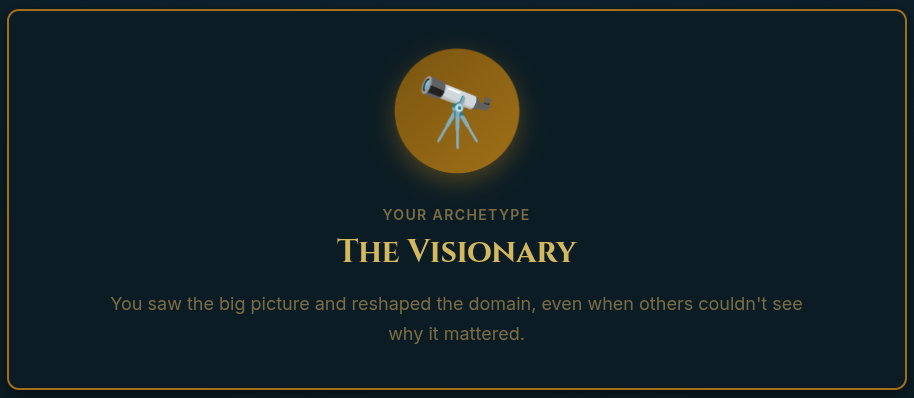
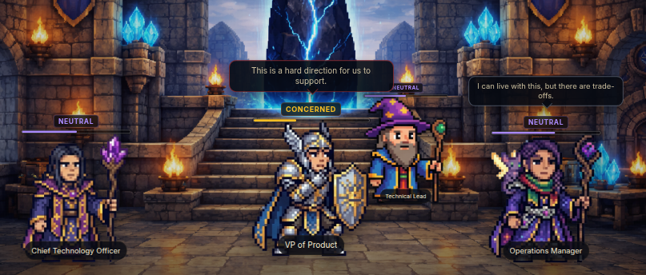

When I set out to build [DDDnD](https://dddnd.app), I wanted something lighthearted. A game that pokes fun at the stuff we all recognize — the tech debt, the stakeholder pressure, the architectural decisions that haunt you at 2am. Something you'd play and laugh and share with your team and go _yes, exactly, this._

I did not expect it to be instructive.

*DDDnD introduction screen, inviting you to join the adventure that is Software Delivery and Systems Architecture*

But here's what happens when you sit down to model software team dynamics honestly, even for laughs: you end up with something that's less parody and more simulation. As I was building out the cards and events and stakeholder reactions, I kept landing on mechanics that I meant to be funny — and were — but also just... worked. As models. The interactions between maintainability and morale, between delivery pressure and technical quality, between individual decisions and system-wide consequences — they kept coming out more accurate than I intended.

At some point I stopped being surprised by the jokes and started being a little unsettled by how well the underlying system held together.

DDDnD is a game where you play a systems architect trying to keep a struggling codebase alive, balancing architecture quality, developer morale, stakeholder satisfaction, delivery confidence, and budget — with every decision involving tradeoffs. It's available at [dddnd.app](https://dddnd.app/). I built it to be fun. What I discovered is that good software team dynamics, modeled honestly, are already a little absurd — and the absurdity isn't decorative. It's structural.

Here's what I mean.

> New here? Before diving in, you might want to read the [launch post for the full picture of what DDDnD is and how it works](./ddddnd-intro.md). Or just keep reading — the mechanics explain themselves pretty quickly.

## The Cost That Doesn't Exist at the Point of Decision

Sometimes you need someone who knows what they're doing, you need them now, and you need them gone by the end of the quarter. The game has a card for this.

*DDDnD card: "Hire Specialized Contractor"*

**Hire Specialized Contractor** — _+8 delivery confidence. −9 budget._

> _"A mercenary solution for a mercenary timeline."_

Three turns later, `contractor_knowledge_leaves` fires: −5 domain clarity, −4 delivery confidence, −3 morale.

*DDDnD aftershock: Contractor knowledge leaves*

I want to be precise about the timing here, because the timing is the point. When you play this card, the numbers look fine. Delivery confidence goes up, the deadline gets more plausible, and the budget hit is painful but survivable. The problem is fully solved. What isn't on the card — what the game tracks separately, on its own schedule — is that the knowledge used to solve the problem leaves with the person who had it.

Three turns later, the system that was fixed is still fixed. The understanding of _why_ it's fixed, and _how_, is gone. Domain clarity drops. Confidence drops. Morale drops, because now you're operating a system nobody fully understands, which is a specific and unpleasant feeling.

The mechanic models something real: the cost of contractor-dependent delivery isn't the contract. It's the institutional knowledge gap that opens up quietly after the invoice is paid.

## The Meeting That Solved the Debt (The Debt Didn't Know)

Every team eventually has the meeting where everyone agrees, out loud, to stop worrying about the tech debt for now. Morale goes up. The debt continues its previous plans.

**Accept Technical Debt Amnesty** — _One-time card. +8 team morale. −7 maintainability._

> _"We'll deal with it next quarter. Definitely next quarter."_

This card has a delayed effect called `technical_debt_accumulates`. It fires whether you play the card or not.

Here's the kicker here: the delayed effect is not triggered by the card. It's always scheduled. The card just gives you a morale boost in exchange for agreeing, collectively, not to stress about it. When I first designed that interaction, I thought it would be a funny eyeroll moment.

What I accidentally modeled here is the difference between acknowledging a problem and addressing it. The morale boost is real — there's genuine relief in a team deciding to stop flagging the same issue every retro. But the debt doesn't care. Sociotechnical systems don't pause because the humans in them reached consensus. The amnesty card isn't cynical; sometimes teams genuinely need that morale boost. But morale and maintainability are separate scores, and a card that moves one doesn't necessarily touch the other.

## The Shadow That Was Never Anyone's Problem

Some systems fail loudly, with warnings and escalations and a postmortem with seventeen attendees. And then there's the other kind.

**Shadow Process Revealed** — _No warning. No delayed effect._

> _"There's a cron job on someone's desktop that processes all refunds."_

Domain clarity −6. Maintainability −4. User trust −3.

Notice what's missing: there's no delayed effect on this one. No `recovery_begins_next_turn`. Just immediate, unrecoverable score damage, and then the game continues.

I designed it this way deliberately. The reason there's nothing to recover from isn't that the damage is especially severe. It's that you can't recover knowledge that was never officially part of the system. There's no remediation path because there was never a formal path in the first place. The cron job worked. Nobody documented it. Nobody knew to. The absence of a delayed effect is the model: when something critical was never officially anyone's problem, its failure can't be officially anyone's fix either. The good news is that even if this card notes an unrecoverable problem -- the system in general can be recoverable in general with other actions. That, too, reflects reality.

## The Correct Decision With the Wrong Timeline

Everyone knows refactoring is necessary. The card that models it is the one I find players most reluctant to play — not because they don't understand the value, but because the game makes the political cost impossible to ignore.

**Cancel Feature Sprint for Refactoring** — _One-time card. +8 maintainability. +4 domain clarity. −6 delivery confidence._

> _"The VP Product's eye just twitched."_

Two turns after you play this, `refactoring_payoff` fires: +8 maintainability, +5 delivery confidence.

*DDDnD event: "Refactoring Pays Off"*

The architecture is correct. The payoff is real. But the political cost arrives immediately — delivery confidence drops, stakeholder satisfaction drops, the VP's eye twitches — and the benefit shows up two turns later, after you've already had to defend the decision in a meeting.

This is the mechanic I find most useful as a model, because it names the actual problem with technically correct decisions inside organizations: it's not that people don't understand the value of refactoring. It's that the cost is visible now and the benefit is visible later, and "later" is a different budget cycle, a different planning period, sometimes a different team. The game doesn't make the refactoring easier. It makes the feedback cycle legible. Two turns is short. In real organizations, "later" can be long enough that the people who made the call aren't around to see the payoff.

## The Stakeholder Who Wins When the System Loses

This one I genuinely didn't design as a commentary. I modeled the event, watched the scores move, and then sat with the output for a moment.

**Urgent Feature Request** — _Fires as an event. VP Product +2 satisfaction._

> _Delivery confidence −5. Morale −4. Budget −4. `technical_debt_accumulates` scheduled._

I didn't intend this one to be a commentary. I just modeled what happens when a high-priority feature request fires mid-sprint. The scores moved the way they move.

And then I looked at the output and noticed: VP Product satisfaction goes _up_. Everything else goes down. The person applying the pressure and the system absorbing the cost are tracked as separate scores, because they are separate things — different people, different incentives, different feedback loops. The VP sees the feature on the roadmap. They don't see the `technical_debt_accumulates` effect that just got scheduled. Those are different information environments, and the game reflects that rather than smoothing it over.

The mechanic isn't a critique of product management. It's a model of misaligned feedback loops — which is a systems problem, not a people problem, and one that doesn't get better by hoping everyone has the same information.

## Disengagement Is Also a Process

Most games would make a key person's resignation a dramatic card you draw at the wrong moment. DDDnD models it as a sequence — because that's what it actually is.

**Lead Developer arc** — Two rules, not one.

The visible rule is `lead_developer_threatens_resignation`, which fires when maintainability drops below 20: morale drops, delivery confidence drops, Lead Developer satisfaction −12. That's the moment everyone notices.

But there's an earlier rule: `lead_dev_fights_for_quality`, which fires when maintainability drops below 35. It also costs morale and delivery confidence — and drops the lead developer's own satisfaction. The fighting itself is expensive, even before anything gets resolved.

The arc the game is modeling isn't really about code quality. It's about the gap between someone's mental model of where the system should be heading and where it's actually going. That gap can be about architecture, or priorities, or process, or any number of things. When someone is persistently out of sync with the direction of the work — not because they're wrong, but because the team hasn't found a way to bridge that gap — the friction accumulates. Engagement drops before the resignation does. The resignation is a lagging indicator.

What I find useful about this mechanic is that it frames disengagement as a feedback signal, not a personality problem. The question it asks isn't "why is this person difficult?" It's "what's been accumulating that we haven't addressed?" Those are very different questions, and they lead to very different responses.

## The Run Is Never Just One Thing

One more thing worth naming, which isn't a card or an event but a design choice I made that turned out to carry more weight than I expected.

When a run ends, you get an outcome archetype: `firefighter`, `burnout_machine`, `runaway_refactorer`, `stakeholder_whisperer`, `boundary_builder`, `visionary`, and others. Two players can end at exactly the same final scores having played completely different strategies — different decisions, different tradeoffs, different paths through the same pressure. The archetypes are how the game distinguishes between them.

This mechanic exists because outcome and process are different things, and knowing the final score doesn't tell you what happened. That's also true of postmortems. Two teams can arrive at the same failed release through completely different sequences of decisions, and a retrospective that only looks at the outcome misses the pattern that produced it.

*DDDnD end screen archetype: The Visionary. You saw the big picture and reshaped the domain, even when others couldn't see why it mattered."*

I added the archetypes because they're more interesting than a score. I realized after the fact that they're also more honest about how the journey actually unfolds — whether you shipped something you're proud of, burned through the team getting there, or found some beautifully chaotic path in between.

## The Game Has Five Starting Scenarios. That's Also the Point.

DDDnD has five starting scenarios: `monolith_of_mild_despair`, `microservice_sprawl`, `compliance_gauntlet`, `startup_hypergrowth`, `merger_of_minor_chaos`. Each one has different starting conditions, different pressure profiles, different events that are likely to fire.

I included them because I thought variety made the game more replayable. What they actually represent is the game's acknowledgment that "struggling software team" looks different depending on how you got there. The microservice sprawl scenario has `service_outage_cascade` — _"Turns out everything really was connected to everything"_ — which hits a completely different set of scores than the monolith's failure modes. Different architecture, different failure pattern, different things that quietly go wrong before the visible crisis.

The scenarios are the game saying: the problems aren't the same everywhere, even when they look similar from the outside.

## What I Didn't Expect to Build

I want to leave you with what I said at the top, but with more precision now that you've seen the mechanics: I built DDDnD to be a lighthearted game about the things we laugh about at work. And it is that.

But in modeling the dynamics honestly — the lag between decision and consequence, the way stakeholder feedback loops diverge from system feedback loops, the sociotechnical reality that code exists inside organizations with people and incentives and competing pressures — I ended up with something that reflects a real truth about software delivery. The hard part is rarely the technical decision in isolation. It's navigating the tradeoffs between competing pressures with incomplete information, inside a system where cause and effect are separated by enough time and organizational layers that the connection is easy to miss.

The game is funny because it runs the defaults and shows you the output in real time. The output is recognizable. And if you look at it clearly, it's also something worth thinking about — not just as a player, but as someone who builds and ships and maintains and works inside these systems every day.

*DDDnD stakeholder avatars, and their mood states.*

## Play It. Share It. Maybe Send It to Your Team.

[Play DDDnD at dddnd.app](https://dddnd.app/). If you haven't read the launch post yet, [start there first](./ddddnd-intro.md) — it gives you the full picture before you start making very defensible bad decisions.

Forward this to someone who has been in a "we'll fix it next quarter" meeting. They'll recognize every single card.
